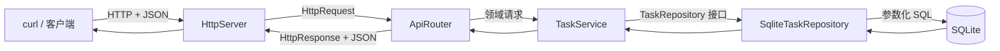
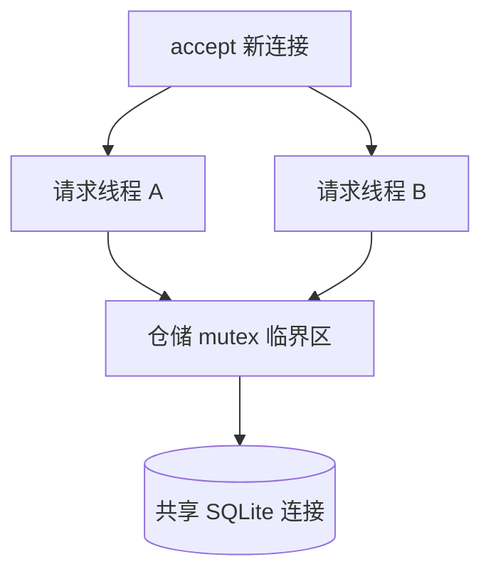

# TaskHub 架构与数据流

## 请求路径

一次 `POST /tasks` 的数据流：

1. `HttpServer` 读取 socket，解析请求行、请求头和请求体。
2. `ApiRouter` 解析 JSON，并把 HTTP 输入转换为 `CreateTask`。
3. `TaskService` 校验标题和描述；它不知道 JSON 或 SQLite。
4. `SqliteTaskRepository` 绑定 SQL 参数并插入数据。
5. `Task` 沿原路径返回，由路由转换为统一的 `{"data": ...}` 响应。

## 分层职责

| 层 | 负责 | 不负责 |
| --- | --- | --- |
| `HttpServer` | TCP 连接、HTTP 报文 | 业务校验、SQL |
| `ApiRouter` | 路由、JSON、状态码 | 数据持久化、线程同步 |
| `TaskService` | 业务规则、领域统计 | HTTP 格式、SQLite API |
| `TaskRepository` | 定义数据访问能力 | 指定具体数据库 |
| `SqliteTaskRepository` | SQL、连接、互斥锁 | HTTP 与 JSON |

## 依赖与可测试性

`TaskService` 构造函数接收 `shared_ptr<TaskRepository>`，只依赖接口。生产环境注入 SQLite 实现；测试也可以注入内存实现或故障实现。构造函数拒绝空依赖，使错误在对象创建时暴露，而不是在请求过程中崩溃。

## RAII 与所有权

| 资源 | 所有者 | 获得时机 | 释放时机 |
| --- | --- | --- | --- |
| SQLite 连接 | `SqliteTaskRepository` | 构造函数 | 仓储析构函数 |
| 预编译 SQL 语句 | `Statement` | `sqlite3_prepare_v2` | `Statement` 析构函数 |
| 服务与仓储 | `shared_ptr` | `main` 创建 | 最后一个共享所有者销毁 |
| socket 文件描述符 | `HttpServer`/处理函数 | `socket`、`accept` | 请求结束时 `close` |

`Statement` 禁止拷贝，因为两个对象同时拥有同一原始语句指针会造成重复释放。

## 并发模型

当前每个连接创建一个分离线程，所有数据库操作用同一把互斥锁串行化。它适合教学，但生产环境需要线程池、连接/请求超时、并发限制、结构化日志和更清晰的停机流程。
